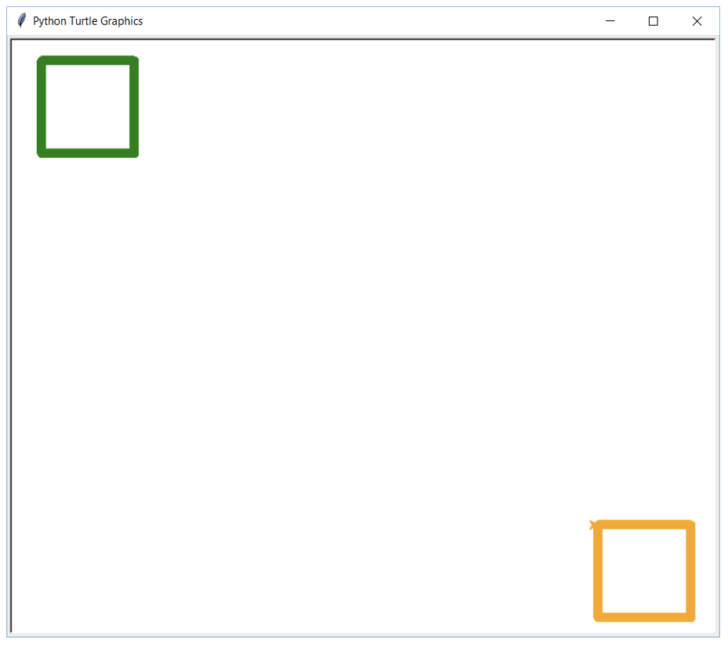
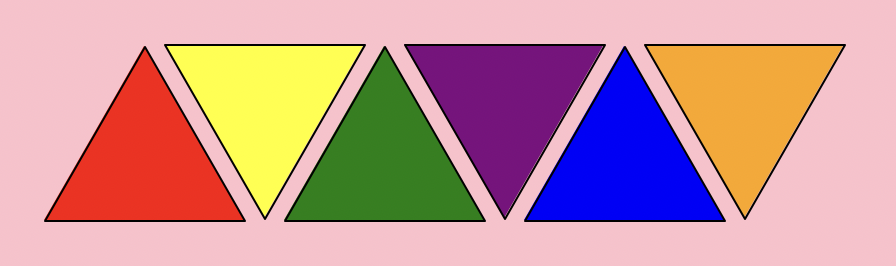

---
hide:
  - toc
---

# Python Turtle Programming


## <!-- Introduction -->

??? note "Introduction"

    This term, you will start developing your knowledge of Python code to learn how to draw graphics on to the computer screen. 

    To do this, you will be using the Turtle module – which is simply an extra part of Python. 

    A module is a library of code written by a very intelligent person. 

    **What does the Turtle Looks Like**

    When you run your first program with the Turtle, you will see a little symbol appear on the screen that will draw your graphics. 

    > Even though it doesn’t look like one, this is the **Turtle**.

    **What can the Turtle do?**

    The Turtle is a great way to learn how to code using Python. 

    By using graphics, it’s a bit more interesting that the usual boring text you see on the screen when coding. 

    The Turtle is capable of drawing almost anything you dream up – you just need to know how to code it! 

    <figure markdown="span">
    { width="400" }
    </figure>


## <!-- Lesson One -->

??? note "Lesson One - Movement and Colour"

    ## __Class Notes - Movement__

    === "1 - Importing the Turtle"

        To import all of the functions in the Turtle module, we need to add the following line of code to the start of every program we write:

        ``` python
        from turtle import *
        ```

    === "2 - Moving Forward"

        You need to think of the Turtle as a pen – as it moves across your screen (which is your canvas), it will draw a line. We can move the Turtle forward and back. 

        The bigger the number, the further your turtle will go. Obviously, the smaller the number, the smaller the line that the Turtle will draw. 

        ``` python title="Moving Forward" linenums="1"hl_lines="3"
        from turtle import *

        forward(100)
        ```

    === "3 - Moving Left"

        To change the direction of your turtle, you will need to tell the Turtle which direction to turn (left or right) and at how many degrees. 

        To turn left use:

        ``` python title="Turning Left linenums="1" hl_lines="3"
        from turtle import *

        left(90) # Turn left 90 Degrees.
        ```

    === "4 - Moving Right"

        To change the direction of your turtle, you will need to tell the Turtle which direction to turn (left or right) and at how many degrees. 

        To turn right use:

        ``` python title="Turning Right" linenums="1" hl_lines="3"
        from turtle import *

        right(90) # Turn right 90 Degrees.
        ```
    
    ## __Class Notes - Colour__

    === "1 - Changing the Pen Colour"

        You can change the color of your pen by using the __color__ function. 


        ``` python title="Changing the Pen Colour" linenums="1" hl_lines="3"
        from turtle import *

        color("Red") # This changes the pen colour to red

        ```
    === "2 - Changing the Pen Thickness"

        You can change the thickness of your line by using the __pensize__ function. 

        The higher the number, the thicker the line becomes:


        ``` python title="Changing the Pen Colour" linenums="1" hl_lines="3"
        from turtle import *

        pensize(10)
        
        ```
    ## __Pupil Tasks__

    === "Task 1 (Turing & Hopper)"

        __Instructions__

        1 - Open th __MU Editor__

        2 - Add a new file

        <figure markdown="span">
          { width="300" }
        </figure>

        3 - Click __save__ and save the file as __01-01-Triangle__

        <figure markdown="span">
          { width="300" }
        </figure>

        4 - A Triangle has __3 equal sides__. 

        5- Each side of your Triangle will be __100 steps in length.__

        6 - Each angle in your Triangle will be __120 degrees__

        7 - The starter code below gives you your __first 2 sides__

        ``` python title="Triangle" linenums="1" hl_lines="1 3 4 5"
        from turtle import *

        forward(100)
        left(120)
        forward(100)
        
        ```

        8 - Add the starter code to your file and complete the __Triangle__

    === "Task 2 (Turing & Hopper)"

         __Instructions__

        1 - Open th __MU Editor__

        2 - Add a new file

        <figure markdown="span">
          { width="300" }
        </figure>

        3 - Click __save__ and save the file as __01-02-Rectangle__

        <figure markdown="span">
          { width="300" }
        </figure>

        4 - Each side of your Rectangle will be __100 steps in length.__

        5 - Each angle in your Rectangle will be __90 degrees__

        6 - The starter code below gives you your __first side__

        ``` python title="Triangle" linenums="1" hl_lines="1 3"
        from turtle import *

        forward(100)
        
        ```

        7 - Add the starter code to your file and complete the __Rectangle__

    === "Task 3 (Hopper)"

         __Instructions__

        1 - Open th __MU Editor__

        2 - Add a __new__ file

        3 - __Save__ the file as __01-03-House__

        4 - Create the image below using __Python Turtle__

        <figure markdown="span">
        { width="150" }
        </figure>

## <!-- Lesson Two -->

??? note "Lesson Two - Co-ordinates"

    ## __Class Notes - Co-ordinates__

    === "1 - Python Co-ordinates"

        The screen in Turtle has been setup with an __x-axis__ and a __y-axis__. 
        
        The default Turtle window size is approximately __750 x 640 steps__ and looks like this:

        <figure markdown="span">
          { width="800" }
        </figure>


    === "2 - Default X and Y"

        When you run your code, Python automatically positions your Turtle at the coordinates (0, 0) – which is the centre of the screen. 

        You can, however, move the Turtle to any position you like on the screen. 


    === "3 - Changing Co-ordinates"

        To change the co-ordinates of the turtle you will need to:

        1. Lift your Turtle up off the page, 
        2. Go to the selected co-ordinates
        3. Put your Turtle back down on the page ready for drawing.

        The code snippet below show you how to do this:

        ``` python title="Changing Co-ordinates" linenums="1" hl_lines="3 4 5"
        from turtle import *

        penup() 
        goto(0,0)
        pendown

        ```

    === "4 - Example"

        To change the direction of your turtle, you will need to tell the Turtle which direction to turn (left or right) and at how many degrees. 

        To turn right use:

        ``` python title="Turning Right" linenums="1" hl_lines="3"
        from turtle import *

        penup()
        goto(-354, 344)
        pendown()

        forward(100)
        right(90)
        forward(100)
        ```

    ## __Pupil Tasks__

    === "Task 1 (Turing & Hopper)"

        __Instructions__

        1 - Open th __MU Editor__

        2 - Add a new file

        <figure markdown="span">
          { width="300" }
        </figure>

        3 - Click __save__ and save the file as __02-01-Squares__

        <figure markdown="span">
          { width="300" }
        </figure>

        4 - Draw a __square__ in the __top left corner__ with a __green outline__.

        5 - Draw a __square__ in the __bottom right corner__ with a __green outline__.

        <figure markdown="span">
        { width="450" }
        </figure>

        7 - The starter code below gives you your __first 2 sides__ of the square in the __top left corner__. __You__ will need to __find and enter the co-ordinates__.

        ``` python title="Triangle" linenums="1" hl_lines="3 4 5"
        from turtle import *

        penup()
        goto(Place your co-ordinates here)
        pendown()

        color("red")
        forward(100)
        left(90)
        ```

        8 - Add the starter code to your file and complete the __task__

    === "Task 2 (Hopper)"

         __Instructions__

        1 - Open th __MU Editor__

        2 - Add a new file

        <figure markdown="span">
          { width="300" }
        </figure>

        3 - Click __save__ and save the file as __01-02-Rectangle__

        <figure markdown="span">
          { width="300" }
        </figure>

        4 - Each side of your Rectangle will be __100 steps in length.__

        5 - Each angle in your Rectangle will be __90 degrees__

        6 - The starter code below gives you your __first side__

        ``` python title="Triangle" linenums="1" hl_lines="1 3"
        from turtle import *

        forward(100)
        
        ```

        7 - Add the starter code to your file and complete the __Rectangle__

    === "Extra Credit Task 1"

         __Instructions__

        To complete these tasks you will need the following extra bits of code:

        ``` python title="Shape & Background Colour Fill" linenums="1" hl_lines="3 4 5 15"
        from turtle import *

        bgcolor("skyblue")  # Change background to sky blue
        fillcolor("yellow") # Select Fill Colour
        begin_fill()        # Start Fill

        forward(100)
        left(90)
        forward(100)
        left(90)
        forward(100)
        left(90)
        forward(100)

        end_fill()          # Stop fill
        ```
        ### Pyramids pt. 1
        
        **Change the background to pink, draw three triangles in a row, fill each with a different colour.**

        `Save this program into your computing folder as ECT-03-Pattern.py`

        * All sides should be 100 Steps
        * All angles should be 120
        * The trinagles should be Red, Green and Blue

        <figure markdown="span">
        { width="450" }
        </figure>

    === "Extra Credit Task 2"

        ### Pyramids pt. 2

        **Draw three triangles and place these inbetween the Triangles from Task 1** 

        `Save this program into your computing folder as ECT-04-Pattern.py`

        * The gap between each each Trinagle should be 80 steps

        <figure markdown="span">
        { width="450" }
        </figure>