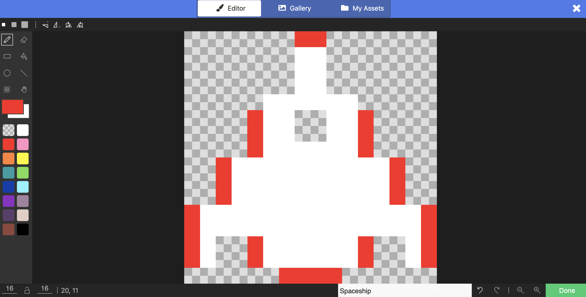
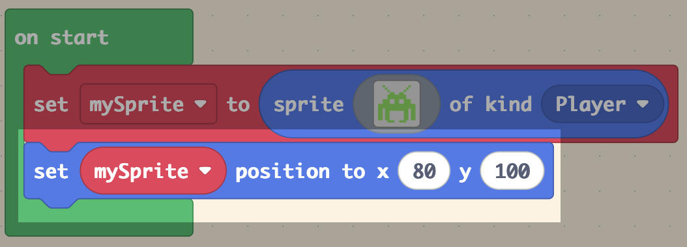
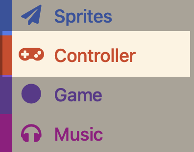
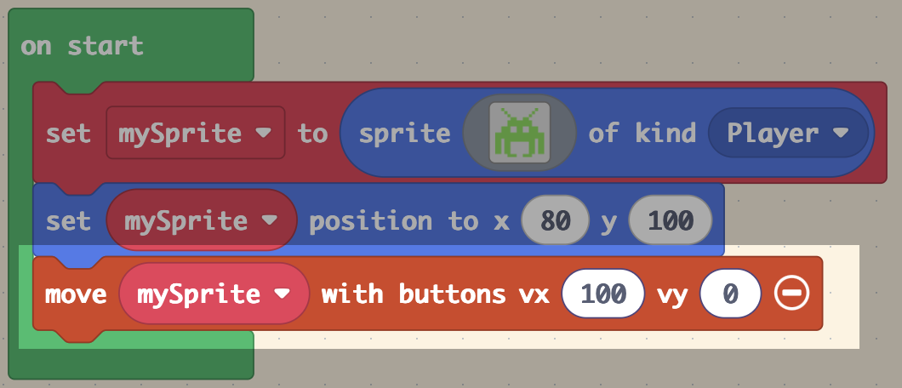
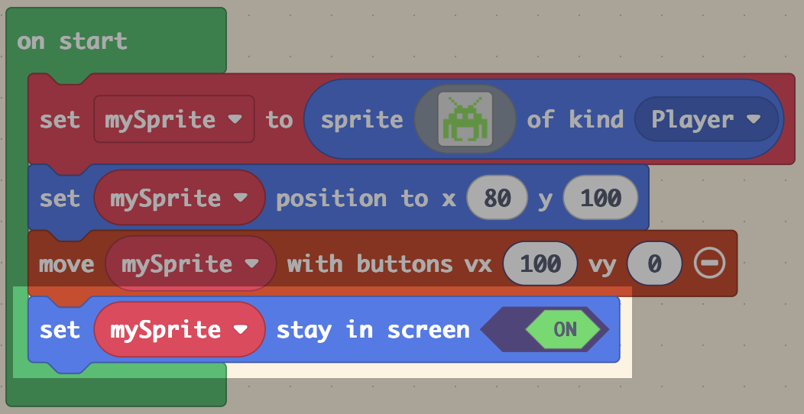
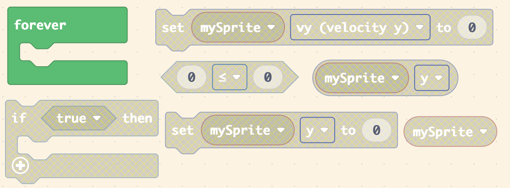

# 👨‍🚀 Setting Up the Player

=== "🕹️ Introduction"

    In this lesson, you will design the player spaceship — the hero of your game. Your player will be able to move left and right across the bottom of the screen using the arrow keys, just like in the classic arcade game.

    Sprites are the characters or objects in your game. By the end of this lesson, you will have created a sprite, placed it on the screen, and added controls so the player can move it using the keyboard.

=== "🧱 Building the Foundations"

    🎯 Success Criteria:

    Create a player spaceship that can move left and right.

    ✅ Instructions

    1 - Open MakeCode Arcade.

    2 - Click New Project and name it Space Invaders.

    3 - In Sprites:

    <figure markdown="span">
    { width="200" }
    <figcaption></figcaption>
    </figure>

    4 - Drag out set mySprite to sprite of kind Player and add it to on start:

    <figure markdown="span">
    { width="500" }
    <figcaption></figcaption>
    </figure>

    5 - Click on the Grey square:

    <figure markdown="span">
    { width="500" }
    <figcaption></figcaption>
    </figure>

    and create your spaceship:

    🚨 Make sure the __canvas size__ is __16 x 16__

    <figure markdown="span">
    { width="500" }
    <figcaption></figcaption>
    </figure>

    6 - Drag a __set mySprite position to x:0  y:0__ and place the sprite at the bottom of the on start block. 

    🚨 Set the coordinates to __x: 80 y: 100__

    <figure markdown="span">
    { width="500" }
    <figcaption></figcaption>
    </figure>

    7 - In __controller__: 

    <figure markdown="span">
    { width="200" }
    <figcaption></figcaption>
    </figure>

    Drag __move mySprite with buttons__ and add it to the bottom of the start block:

    🚨 Click __+__ and set the coordinates to __vx: 100, vy: 0__ to allow only horizontal movement:

    <figure markdown="span">
    { width="500" }
    <figcaption></figcaption>
    </figure>

    8 - In Sprites:

    <figure markdown="span">
    { width="200" }
    <figcaption></figcaption>
    </figure>

    Drag __move mySprite stay in screen__ and add it to the bottom of the start block:

    🚨 Set the slider to __on__ to stop the spaceship from leaving the screen:

    <figure markdown="span">
    { width="500" }
    <figcaption></figcaption>
    </figure>

    🧪 Checkpoint

    You should be able to move your ship left and right.

=== "🎮 Turing" 

    🎯 Success Criteria:
    
    Create a simple title screen that appears before the game starts.

    💡 This helps your game feel more complete and gives players a clear starting point.

    ✅ Instructions:

	1.	Go to the __Game__ section
	2.	Drag out the __splash__ block and add it to the top of your start block
	3.	Type your game name into the __splash block__ e.g. __"Space Invaders"__ or __"Alien Blaster!"__

=== "👾 Hopper"    

    🎯 Success Criteria: 
    
    Let the player move diagonally using arrow keys.

    💡 This allows your spaceship to move up and down as well as left and right.

    ✅ Instructions:

    1.	Find the block __move mySprite with buttons vx vy__.
    2.	Change __vy from 0 to 100__.
    3.  Using the blocks below, restrict the __Y movement range__ so the ship stays in the lower part of the screen:

    <figure markdown="span">
    { width="500" }
    <figcaption></figcaption>
    </figure>

     🚨  Some blocks may need to be __duplicated__

    