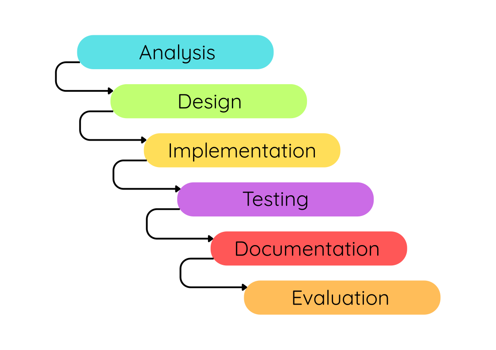

---
hide:
  - toc
---

# Development Methodologies

!!! tip "Quick Links"

    * [The Software Development Lifecycle](#the-software-development-lifecycle)
    * [The Waterfall Method](#the-waterfall-method)
    * [Agile Methods](#agile-methods)
    * [Iterative vs. Agile Development Processes (Key Points)](#iterative-vs-agile-development-processes-key-points)

!!! info "What you need to know"

    You must be able to describe and compare the development methodologies:

    * iterative development process
    * agile methodologies

## The Software Development Lifecycle

<figure markdown="span">
  { width="600" }
</figure>

The __Software Development Lifecycle__ is generally an iterative process that consists of six stages:

* Analysis - to fully understand the problem and what the program must do
* Design - to plan how the program will work before building it
* Implementation - to write the actual code
* Testing - to check that the program works correctly and meets the requirements
* Documentation - to produce materials that help users and future developers understand and use the software.
* Evaluation - to judge how successful the software is

## The Waterfall Method

A traditional method of software development is called the __Waterfall Method__.

<figure markdown="span">
  { width="600" }
</figure>

The __Waterfall Method__ is classified as a linear development process, as the developer or development team works through each stage sequentially with little to no involvement from the client until the final product is delivered.

Although it is classified as a linear development process, in practice it is often necessary to revisit earlier stages. For example, if an issue is discovered during testing, the team may need to go back and revise the design, reimplement it, and test it again.

In the early days of software engineering, this process made sense. 

__However, it is rarely used in modern software development due to its lack of flexibility__.

In the real world, many developers use __Agile methods__.

## Agile Methods

__Agile__ is considered more flexible than traditional iterative methods. 

Instead of following a rigid sequence of stages, Agile breaks the project down into smaller, manageable units of work, often called __“sprints”__. 

Each sprint typically lasts __one to four weeks__ and involves a cycle of planning, design, implementation, and testing. This approach allows teams to produce working software early and update it frequently based on feedback.

A key benefit of Agile is its emphasis on collaboration and adaptability. Stakeholders, including clients and end-users, are involved throughout the development process, not just at the beginning or end. This ongoing communication helps ensure that the software continues to meet the users’ needs as they evolve.

By regularly reassessing priorities and making improvements at each step, Agile teams can respond to changes quickly—something that is much harder to do with more traditional methods like Waterfall. As a result, Agile has become one of the most widely adopted methodologies in modern software development.

For a useful comparison of __waterfall vs. agile__ watch the video below:

<figure markdown="span">
<iframe width="560" height="315" src="https://www.youtube.com/embed/GzzkpAOxHXs?si=9Tfwd4eWTetNd3GU" title="YouTube video player" frameborder="0" allow="accelerometer; autoplay; clipboard-write; encrypted-media; gyroscope; picture-in-picture; web-share" referrerpolicy="strict-origin-when-cross-origin" allowfullscreen></iframe>
</figure>

## Iterative vs. Agile Development Processes (Key Points)

<table>
  <tr>
    <th>Iterative</th>
    <th>Agile</th>
  </tr>
  <tr>
    <td><strong>In Iterative development</strong> , the client typically participates only at the <strong>analysis</strong> and <strong>evaluation</strong> stages. The stages in between (design, implementation, and testing) are usually carried out without further client input.</td>
    <td><strong>In contrast, Agile</strong> encourages <strong>frequent client feedback</strong> throughout the project. This ongoing collaboration helps shape the product as it develops and usually results in a solution that better meets the client’s needs and expectations.</td>
  </tr>
  <tr>
    <td><strong>In traditional Iterative development</strong>, separate teams are often responsible for individual phases of the project. For example, a design team may complete the design stage and then hand the work over to an implementation team, who in turn pass it on to a testing team. This can lead to communication issues and delays if problems are discovered late in the process.</td>
    <td><strong>Agile teams are cross-functional</strong> and collaborative. Rather than handing work off between phases, teams combine designers, developers, and testers who work together on the same features with continuous feedback and rapid problem-solving.</td>
  </tr>
  <tr>
    <td><strong>Iterative development</strong> depends on a single, detailed project document called the <strong>project specification</strong>. This document is created at the start and referred to throughout the project. If requirements are misunderstood, issues may only become clear late in development.</td>
    <td><strong>Agile development</strong> reduces formal documentation. It favours lightweight, flexible documentation created during the project, with a stronger focus on working software and communication over paperwork.</td>
  </tr>
  <tr>
    <td><strong>Progress in Iterative development</strong> is typically measured by completing each phase in order, with the final product being delivered to the client for evaluation at the end.</td>
    <td><strong>Progress in Agile</strong> is measured by how quickly features are delivered and demonstrated. Agile teams aim to produce working software early and often, with regular feedback from the client after each sprint.</td>
  </tr>
  <tr>
    <td><strong>Iterative development</strong> relies heavily on the initial analysis stage. If the requirements are misunderstood at this point, the issue may not be discovered until the testing or evaluation phase. By then, a significant amount of time, effort, and money may have been lost developing the wrong solution.</td>
    <td><strong>Agile development</strong> involves testing and evaluation much more frequently, with regular progress reviews involving the client. If mistakes or misunderstandings are identified, they can be corrected early in the process—making it easier and less costly to get back on track. The client plays a much more active role in Agile development, providing ongoing feedback throughout the project.</td>
  </tr>
</table>

