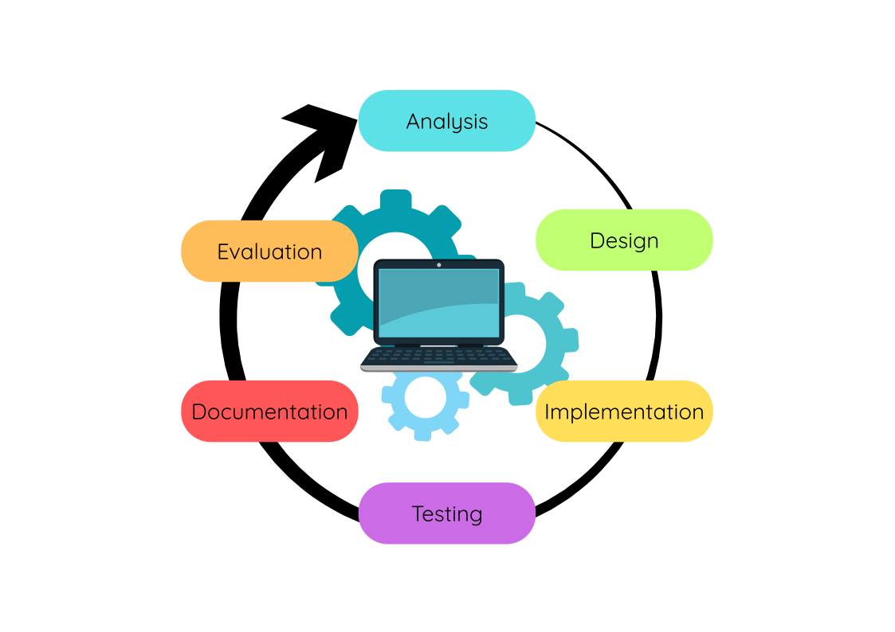
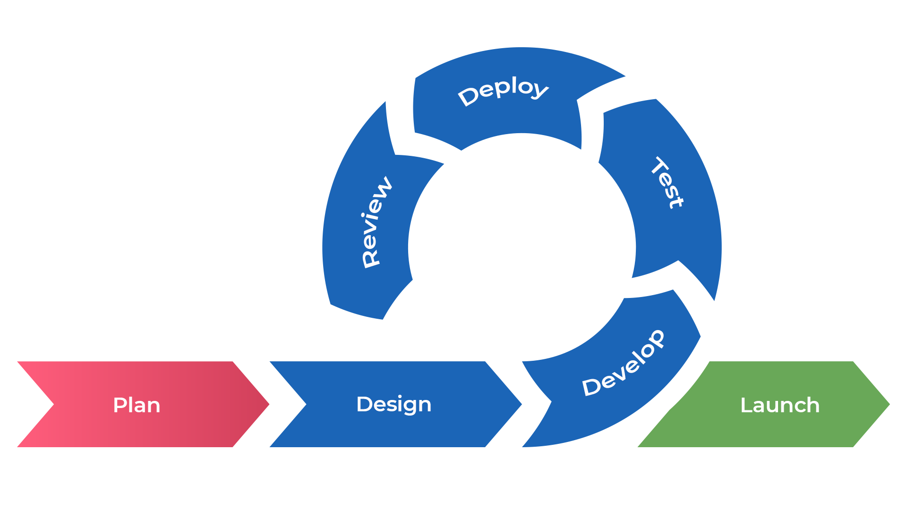

---
hide:
  - toc
---

# Development Methodologies

!!! tip "Quick Links"

    * [The Software Development Lifecycle](#the-software-development-lifecycle)
    * [The Waterfall Method](#the-waterfall-method)
    * [Agile Methods](#agile-methods)
    * [Iterative vs. Agile Development Processes (Key Points)](#iterative-vs-agile-development-processes-key-points)

!!! info "What you need to know"

    You must be able to describe and compare the development methodologies:

    * iterative development process
    * agile methodologies

## The Software Development Lifecycle

<figure markdown="span">
  { width="600" }
</figure>

The __Software Development Lifecycle__ is generally an iterative process that consists of six stages:

* Analysis - to fully understand the problem and what the program must do
* Design - to plan how the program will work before building it
* Implementation - to write the actual code
* Testing - to check that the program works correctly and meets the requirements
* Documentation - to produce materials that help users and future developers understand and use the software.
* Evaluation - to judge how successful the software is

## The Waterfall Method

A traditional method of software development is called the __Waterfall Method__.

<figure markdown="span">
  { width="600" }
</figure>

The __Waterfall Method__ is classified as a linear development process, as the developer or development team works through each stage sequentially with little to no involvement from the client until the final product is delivered.

Although it is classified as a linear development process, in practice it is often necessary to revisit earlier stages. For example, if an issue is discovered during testing, the team may need to go back and revise the design, reimplement it, and test it again.

In the early days of software engineering, this process made sense. 

__However, it is rarely used in modern software development due to its lack of flexibility__.

In the real world, many developers use __Agile methods__.

## Agile Methods

__Agile__ is considered more flexible than traditional iterative methods. 

Instead of following a rigid sequence of stages, Agile breaks the project down into smaller, manageable units of work, often called __“sprints”__. 

<figure markdown="span">
  { width="800" }
</figure>

Each sprint typically lasts __one to four weeks__ and involves a cycle of planning, design, implementation, and testing. This approach allows teams to produce working software early and update it frequently based on feedback.

A key benefit of Agile is its emphasis on collaboration and adaptability. Stakeholders, including clients and end-users, are involved throughout the development process, not just at the beginning or end. This ongoing communication helps ensure that the software continues to meet the users’ needs as they evolve.

By regularly reassessing priorities and making improvements at each step, Agile teams can respond to changes quickly—something that is much harder to do with more traditional methods like Waterfall. As a result, Agile has become one of the most widely adopted methodologies in modern software development.

For a useful comparison of __waterfall vs. agile__ watch the video below:

<figure markdown="span">
<iframe width="560" height="315" src="https://www.youtube.com/embed/GzzkpAOxHXs?si=9Tfwd4eWTetNd3GU" title="YouTube video player" frameborder="0" allow="accelerometer; autoplay; clipboard-write; encrypted-media; gyroscope; picture-in-picture; web-share" referrerpolicy="strict-origin-when-cross-origin" allowfullscreen></iframe>
</figure>

## Iterative vs. Agile Development Processes (Key Points Comparison)

<table>
  <tr>
    <th></th>
    <th>Iterative</th>
    <th>Agile</th>
  </tr>
  <tr>
    <td><strong>Client Interaction</strong></td>
    <td>The client is usually involved only at the <strong>analysis</strong> and <strong>evaluation</strong> stages. There is little to no client input during design, implementation, and testing phases.</td>
    <td>Agile encourages <strong>frequent client feedback</strong> throughout the project. Ongoing collaboration helps shape the product and ensures it meets client needs.</td>
  </tr>
  <tr>
    <td><strong>Teamwork</strong></td>
    <td>Separate teams handle different phases independently, such as design, implementation, and testing. Communication between teams can be limited, potentially causing delays if issues arise.</td>
    <td>Agile teams are <strong>cross-functional</strong> and collaborative, combining designers, developers, and testers who work together continuously with rapid communication and shared goals.</td>
  </tr>
  <tr>
    <td><strong>Documentation</strong></td>
    <td>Relies on a single, detailed <strong>project specification</strong> created at the start, which guides the entire project. Changes late in the project can be costly.</td>
    <td>Minimizes formal documentation, favouring lightweight, flexible documents created as needed. Focus is on working software and communication over paperwork.</td>
  </tr>
  <tr>
    <td><strong>Measurement of Progress</strong></td>
    <td>Progress is measured by completing each phase in order, with the final product delivered at the end for client evaluation.</td>
    <td>Progress is measured by how quickly features are delivered and demonstrated. Agile teams deliver working software regularly with frequent client feedback.</td>
  </tr>
  <tr>
    <td><strong>Adaptive vs Predictive</strong></td>
    <td>Iterative development is more <strong>predictive</strong>, relying on detailed upfront planning and following a set sequence of phases.</td>
    <td>Agile is highly <strong>adaptive</strong>, embracing change and continuously adjusting based on feedback and testing throughout the project.</td>
  </tr>
  <tr>
    <td><strong>Testing</strong></td>
    <td>Testing happens mainly after implementation in a distinct phase, often late in the process, risking discovering problems late.</td>
    <td>Testing is continuous and integrated throughout development. Each part is tested as it is built, reducing costly late fixes.</td>
  </tr>
</table>

