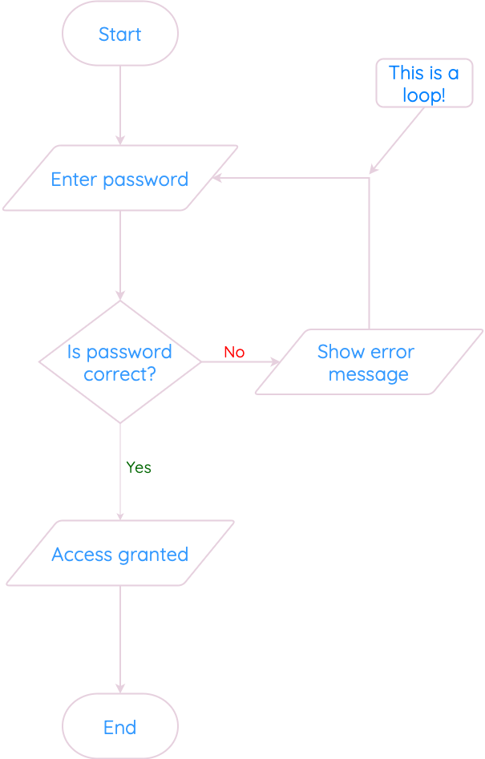

---
hide:
  - toc
---

# Design

!!! info "What you Need to Know"

    Identify the data types and structures required for a problem that relates to the implementation at this level, as listed below.
    
    Describe, identify, and be able to read and understand:
    
    : * structure diagrams
            
    : * flowcharts
            
    : * pseudocode
    
    Exemplify and implement one of the above design techniques to design efficient solutions to a problem.
    
    Describe, and implement user-interface design, in terms of input and output, using a wireframe.

Efficient problem-solving in computing begins with careful planning and the use of appropriate design techniques to ensure solutions are both effective and easy to implement. 

A key aspect of this process involves identifying the data types and structures required to solve a problem. These choices are critical, as they influence how efficiently a program can handle inputs, process data, and deliver outputs.

To design and understand solutions, several tools and techniques are used:

* Structure diagrams provide a visual breakdown of a system, showing its components and how they interact.

* Flowcharts illustrate the logical flow of processes, making it easier to follow the sequence of steps within an algorithm.
  
* Pseudocode bridges the gap between natural language and programming by offering a simplified, language-agnostic way to represent a solution.

In addition, user-interface design (__wireframes__) are another essential element that usees simple sketches or digital drafts that outline the layout of a user interface, detailing how input and output are managed.

## Flowcharts

Flowcharts are used to show the sequence of steps in a program. We read the flowchart from top-to-bottom, following the arrows.

You can use a flowchart with any program, but they are good for clearly showing decisions and loops.

<figure markdown="span">
      { width="800" }
</figure>

    
Flowcharts don’t have a specific symbol for loops. Instead, they have to show a loop as a decision, with the arrows going up/backwards.

In this example, if the password is not correct, the program shows an error message, and then the arrow points back towards asking for the password again. 

This loop will continue until the user enters a correct password, breaking the loop.

<figure markdown="span">
      { width="350" }
</figure>

!!! info

      Some people prefer flowcharts to other notations, and others don’t. 
      
      According to the course spec, you should never be in a position where you have to draw a flowchart from scratch: you usually have a choice of at least two design notations (e.g. a flowchart or a structure diagram). 
      
      ==However, you do need to be able to read and understand a flowchart, and answer questions on one that you are given.==

## Pseudocode

Pseudocode (pronounced sudo-code) is a way of planning your program line-by-line, without writing actual code. 

!!! info "Key Points"

    Pseudocode isn’t as strict as a real programming language. 
    
    We write pseudocode in English. 
    
    There are no fixed rules for how it should look. 

==So long as you break the problem down into steps, and your meaning is clear, you can be awarded the marks.==

You will get more used to seeing pseudocode as you work on practical tasks, as lots of the examples will use it for their design.

The SQA gives the following example of pseudocode to calculate the volume of a swimming pool.

First, we break the problem down into steps:

1. Ask user to enter dimensions of the swimming pool in metres
   
2. Calculate volume of pool (`length * width * depth`)
   
3. Display message stating the volume of the pool

For step 1 (ask the user to enter dimensions), we can break this down further into `1.1`, `1.2` and `1.3`. 

==These are called refinements.== 

Each refined line could later be translated straight into a line of program code.

`1.1` Ask user to enter length

`1.2` Ask user to enter width

`1.3` Ask user to enter height

## Wireframe Diagrams

For software development, all you have to do is sketch a (`rough`) interface based on the inputs and outputs.

The actual programs we create in Python don’t have buttons. However, you can draw a wireframe design with buttons and textboxes if you wish.

In practice, most of your program interfaces will be made up of lines of text:

``` pseudocode linenums="1"
Please enter your name: John
Please enter how many tickets you would like: 5

You have asked for 5 tickets. That will cost £25
```

In this example, there are two inputs (name and number of tickets), and one output (the cost).

All you have to do is draw a (`reasonable`) interface with the right inputs and outputs. 

If you were asked to draw an interface for a calculator program, that asks for two numbers, and multiplies the result, it could be something like:

``` pseudocode linenums="1"
Please enter first number:________
Please enter second number:_______ 

Total multiplied is_______________
```
