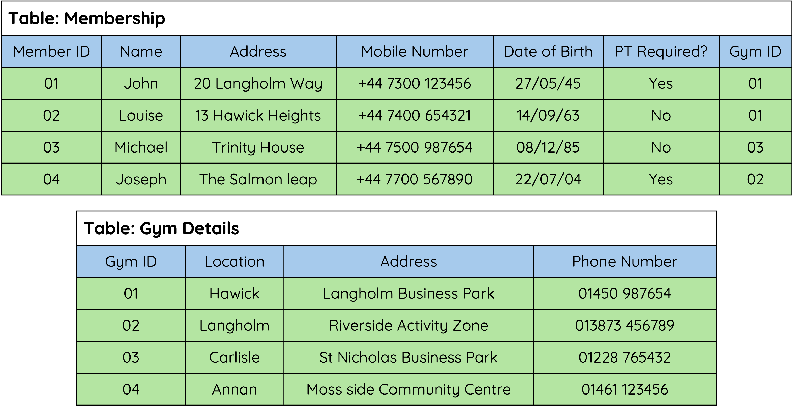
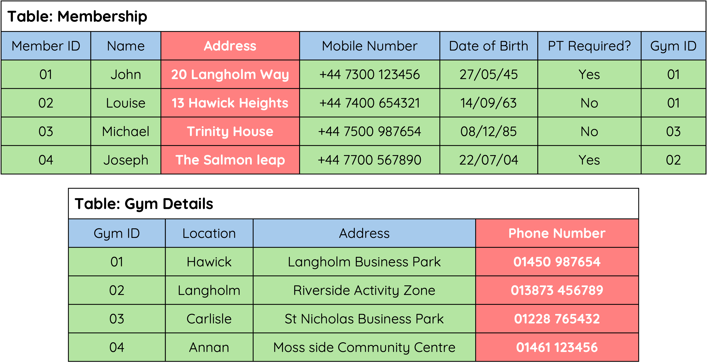
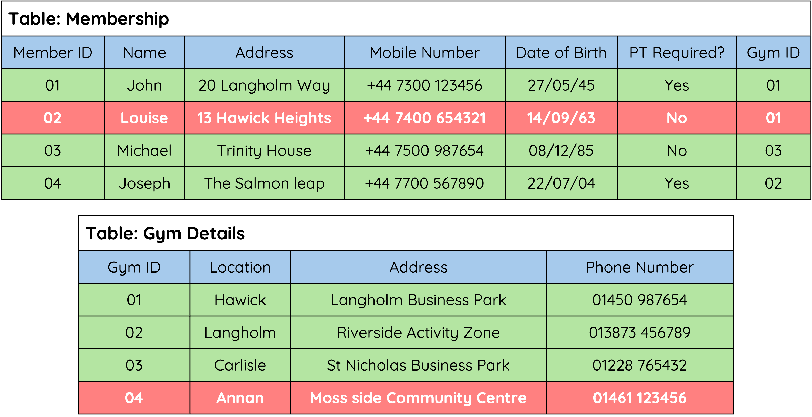

---
hide:
  - toc
---

# Database Structure

## What is a Database?

A database is an organized collection of information or data. Putting information into a computer database gives you far more flexibility in organising, displaying and printing that information.
Almost everyone who uses a computer will use a database system for something:

* Banks use a database package for storing customers' accounts information
* Your school will use a database package to store information on all the pupils in the school
* Police use databases to keep information on people with criminal records

{ width="700" }

## Flat File Databases

A flat file database is a database that stores all data in a single table:

* Only one table is used.
* There are no relationships between multiple tables.
* All data is stored in rows and columns within that one table.

## Structure of a Flat File Database

__Fields__

A 'Field' holds one piece of data at a time – for example, a person's name, age, or phone number.

{ width="700" }

__Records__

A 'Record' holds all the data for one entry in the table – for example, all the information about a single customer.

{ width="700" }

## Relational Databases

A relational database consists of two or more tables that are linked through relationships between the data they store.

🚨 __Note__

In database design, each `Table` in a relational database represents an __Entity__ — a real-world object like a Customer or Product.

Each `Field` (or column) in the table represents an __Attribute__ — a property of that entity, such as Name or Price.

This difference is important when designing the structure of your database, even though software like Access may still use the terms __*table*__ and __*field*__.

⚠️ __Don’t confuse a record with an entity__. In a flat file database, each record is one instance of an entity (e.g. one customer). In relational databases, the table represents the entity.

!!! info "Advantages of Using a Relational Database"

    * Avoids data duplication.
    * Complex queries can be carried out on multiple tables.
    * Easier to maintain security.
    * Easier to change/update data.

## Database Data Types

__Text__

Text fields will store characters or words. 
Can be a combination of text and numbers such as a postcode or an address with a street number (PH33 7BP or 14 High Street)

__A telephone number would be a text field. This is because we don't perform calculations with the number and also because some phone numbers are a combination of letters and numbers.__

Even though a telephone number contains only digits, we treat it as text because we don’t perform calculations on it.

__Number__

Number field types can store whole numbers (integers) such as 8,99,236 or numbers with decimal places (real numbers) such as 76.33, 2.11, 4.5.

__Date__

This field type will store dates. These can be stored in different formats. You will decide when you design the table what format you would like to choose. 

__Time__

A time field stores the time of day. This will normally be in 24-hour format such as 15:30

__Boolean__

A Boolean field is either true or false / yes or no. A Boolean field is used when there are only two possible values, such as __Yes/No__, __On/Off__, or __True/False__.

For example: “__Has Paid?__” or “__Is Member?__”

