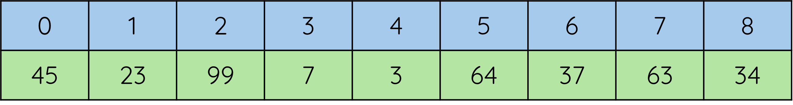
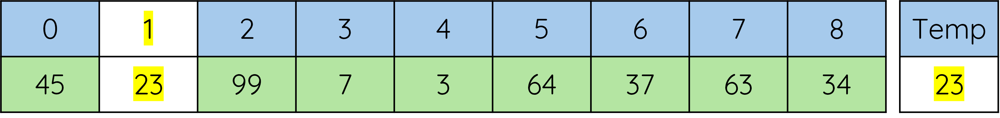
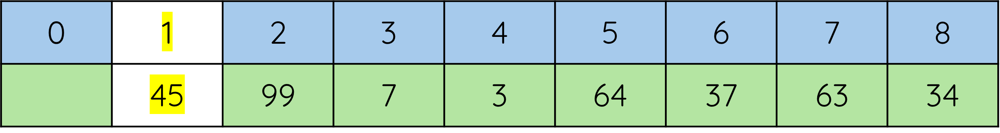

# Insertation Sorts

!!! info "What you need to Know"

	Describe, exemplify, and implement insertation sorts
	
	Read and explain code that uses constructs appropriate to this level.

## Explanantion

An insertion sort traverses an array from the second element to the last. 

Each element is compared to the elements before in turn, working backwards down the list.  Values are swapped until the element being compared is placed in order

Consider the following  array

<figure markdown="span">
  { width="800" }
</figure>

### Insertion Sort - Iteration 1

Start with element 1 of the list to be sorted.  __This value is temporarily stored__.

<figure markdown="span">
  { width="800" }
</figure>

If the temp value is smaller than the value before it (element 0), then the value before it, is copied to the right (element 1).

<figure markdown="span">
  { width="800" }
</figure>


Each value, to the left of the element (__where the temp value was originally stored__) is compared until :

	* The value being compared is smaller that the stored temp value or 
 
 	* the start of the list has been reached

When either of the above is true, the temp value is copied back into the list at the previous position.

### Insertion Sort - Iteration 2

The next value (__99__) is copied into the temp.

When the next value (__99__) is examined, the value before it (__45__) is smaller, __so no further action is required__

### Insertion Sort - Iteration 3

The next value (7) is copied into the temp.

When the temp value (7) is compared with element 2 (99) , it is smaller so 99 is copied into element 3

When the temp value (7) is compared with element 0 (23), it is smaller so 23 is copied into element 1


Modularity means that when a program is written it is split up into smaller chunks called sub-programs. Imagine a program with millions of lines of. This would be split up into different programming teams to complete. 

Each of the sub-programs does a specific job. For example one sub-program may be to get user information. Each of the subprograms can be used in any order and can be reused multiple times. 

!!! example
	```Python
	
	```

## Procedures in Python

### What is a procedure? 
We'll use an analogy here. Let's imagine that you're a dishwasher. Your process of washing a dish could be:

- Dip the dish into the water
- Cover every inch of the dish with soap 
- Rinse and dry the dish

So, every time you need to wash a dish, you do just that. Dip, soap, dry. Dip, soap, dry. Dip, soap, dry. Even when you go home, you dip, soap, dry. Dip, soap, dry. It's the same sequence, repeated over and over again. 

A procedure works the same way. People replace the process of dipping, soaping, and drying with the command "wash the dishes". When you call a procedure, it simply does the jobs that the procedure is supposed to do. 

By replacing a stack of instructions with one single statement, it makes code easier to read and debug. A procedure does not return a value.

In Python we give a procedure a name, this is done by giving them a name after the, “def” instruction. The brackets after the procedure name are used to pass in data that will be used in that block of code. This is known as parameter passing. 

!!! info
	A procedure literally just executes commands.
